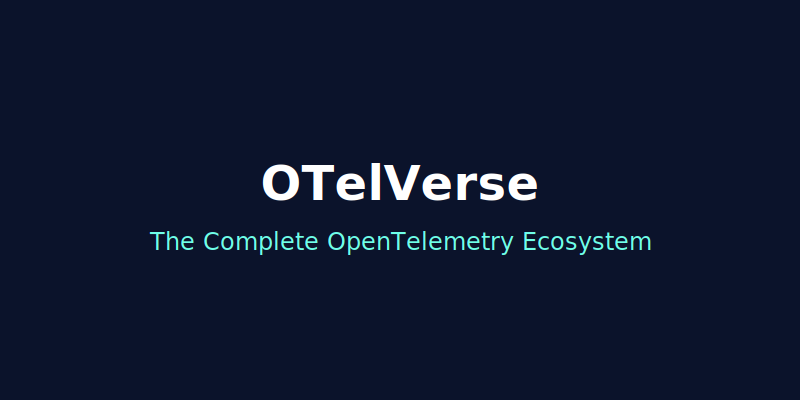

## The Problem
OpenTelemetry adoption is fragmented. While it's the de-facto standard for generating telemetry data, teams struggle with configuration, lack of frontend-to-backend correlation, and the absence of a unified platform that just works out of the box. Building an observability stack today means stitching together half a dozen tools.

## The Solution
**OTelVerse** is a modular, open-core platform that unifies traces, logs, metrics, pipelines, chaos engineering, session replay, and more—all native to OTLP. We provide everything you need to observe, optimize, and break your systems in one unified experience.

<!-- truncate -->

## The 10 Products
OTelVerse is built as a suite of tightly integrated products:
1. **Unified Platform**: A central GraphQL and React-based control plane to view traces, session replays, and manage pipelines.
2. **Visual Pipeline Builder**: Drag-and-drop ReactFlow interface to configure your OTel Collector processors, receivers, and exporters.
3. **Chaos Engine**: An OTLP-native proxy that injects logical latency and simulated errors right into targeted microservices to test system resilience.
4. **AI Optimizer**: Automatically detects PII and high-error traces, recommending robust sampling policies to save costs.
5. **Session Replay**: rrweb integration linking DOM snapshot replays directly to distributed trace timelines.
6. **Metrics Dashboard**: Native metric dashboards with drag-and-drop charts and pre-built service dashboards.
7. **Log Viewer UI**: A fast log viewer with filtering, trace linking, and metric-trace correlation.
8. **Edge Agent**: A lightweight Rust-based agent for gathering telemetry from IoT devices and edge nodes.
9. **Robotics SDK**: Comprehensive observability SDK for ROS 2 and Gazebo simulators.
10. **Integration Kits**: Ready-to-go Docker Compose and Kubernetes deployments to run the whole stack.

## Quick Start
Get started in seconds with our Docker Compose integration kit:
```bash
git clone https://github.com/otelverse/platform.git
cd platform/packages/integration-kits/compose/otelverse-kit
make up-all
```
Your platform will be available at `http://localhost:8081`. See traces flow in instantly!

## Open Source & Community
OTelVerse is released under the **Apache 2.0** license. We believe observability should be accessible to everyone. 
Check out our [GitHub repo](https://github.com/otelverse/platform) and join our [Discord community](https://discord.gg/otelverse) to chat with the maintainers and other users.

## What's Next
We are working on bringing more advanced alerting features, deeper Kubernetes native integrations, and expanded Edge capabilities. 

We'd love your feedback and contributions! Let's build the future of observability together.
